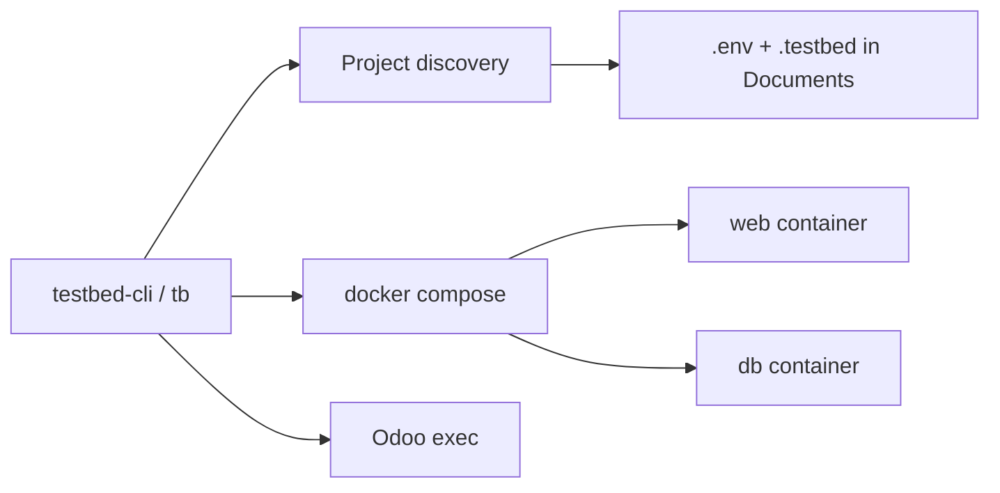

# Testbed CLI

One-stop CLI for Odoo testbeds. It discovers your Odoo repos and drives everything the `.testbed` submodule already does - start, stop, restore, tests, modules, translations - without hopping between bash scripts.

This started as a Textual TUI (`testbed-tui`). The TUI was dropped. The product is now **testbed-cli**, invoked as `tb`.

## What exists in the Odoo repos

Each Odoo repo vendors a `.testbed` submodule. It is a Docker Odoo + Postgres stack plus bash scripts. Project identity lives in `.env`:

```
MODULES_TO_TEST=...
DATABASE_NAME=demo   # also names the compose project: testbed-${DATABASE_NAME}
ODOO_VERSION=18
```

Current capabilities (the scripts have drifted between copies):

- **Lifecycle:** `init.sh`, `prepare-and-run-testbed.sh` (plain start or `init` empty DB), `stop-testbed.sh`, `tear-down-testbed.sh`
- **Data:** `start_db_from_backup.sh` (`.zip` / `.sql` / `.dump` + neutralize SQL), `tbpsql.sh`
- **Dev:** `reload-module.sh`, `update-custom-modules.sh`, `translations.sh`, `kill-pydebug.sh`
- **Tests:** `run-pytests.sh` (custom modules via pytest-odoo, standard/enterprise via Odoo `--test-tags`)
- **Docker:** web (debugpy on 3001 in the override) + postgres, enterprise from `/opt/odoo/enterprise_${ODOO_VERSION}`, addons mounted at `/mnt/extra-addons`
- **VS Code:** launch/tasks that used to call those scripts; `tb vscode` rewrites them to call `tb`

Pain this CLI absorbs:

- Script drift between repos (wait-for-ready greps, enterprise git reset, extra scripts)
- Host ports **8069 / 8068 / 8888** are hardcoded in compose - only one testbed at a time by default
- You have to remember which script, from which repo root
- Filestore restore was explicitly unsupported in the bash restore path

Do **not** rewrite Docker. Keep each project's `.testbed` compose/Dockerfile/SQL. This tool is the control plane.



## Project setup

- Python 3.12+, [Typer](https://typer.tiangolo.com/) for the CLI
- Install with `./install.sh` (or `pipx install --editable .` from the clone)
- Commands: `tb` and `testbed-cli`
- Tests live under `tests/` (`pytest`)
- This repo's own VS Code launch/tasks live in `.vscode/`; Odoo-project files come from `src/testbed_cli/templates/vscode/`

Run `tb setup` once after install (or whenever the paths change). It writes `~/.config/testbed-cli/config.toml`. An older `~/.config/testbed-tui/config.toml` is still read if the new file is missing.

```bash
tb setup
tb setup --show
tb setup --defaults
tb setup --odoo-root /opt/odoo --project-root ~/Documents --no-parallel
tb doctor
```

Config keys:

```toml
project_roots = ["/home/you/Documents"]
odoo_root = "/opt/odoo"
backup_roots = []          # empty means "same as project_roots"
allow_parallel = false
```

| Key | Meaning |
|---|---|
| `project_roots` | Folders whose children are scanned for `.env` + `.testbed` |
| `odoo_root` | Where `enterprise_${version}` is cloned/updated |
| `backup_roots` | Extra folders to look for dumps; empty uses project folders |
| `allow_parallel` | Allow more than one compose stack; otherwise `tb start` refuses |

A discovered project is a folder with `.env` (`DATABASE_NAME`, `ODOO_VERSION`) **and** `.testbed/docker/docker-compose.yml`. Resolve by database name, folder name, or path.

## Architecture

Thin Python wrappers around the **same docker compose / odoo exec** the bash scripts already run. Subprocess `docker compose`, not a Docker SDK.

```
testbed-cli/
  pyproject.toml
  README.md
  plan.md
  install.sh
  .vscode/               # launch/debug this CLI
  src/testbed_cli/
    __main__.py
    cli.py               # tb commands
    config.py
    discovery.py
    project.py           # load .env, addons, compose paths
    dockerctl.py         # compose up/stop/down, exec, logs, cp, wait-ready
    lifecycle.py         # start, stop, restore, dump, exclusive lock
    ports.py
    process.py
    enterprise.py
    modules.py
    i18n.py
    tests_run.py
    extras.py            # browser, psql, shell, mailpit, vscode, licences
    templates/vscode/    # launch/tasks written by `tb vscode`
    init_project.py
  tests/
```

Unify wait-ready on both current greps (`HTTP service (werkzeug) running` **or** `Evented Service (longpolling) running`) with a timeout.

Keep existing bash scripts working. Later they can become one-liners that call `tb`.

Only one testbed runs at a time unless you pass `--parallel` or set `allow_parallel = true`. Parallel mode reallocates host ports when they clash.

## Commands

Grouped the same way as `tb --help`.

### Setup and initialise

| Today | CLI |
|---|---|
| config | `tb setup` / `tb setup --show` |
| `init.sh` | `tb init PATH --db NAME --odoo 18 --module foo` |
| VS Code files | `tb vscode NAME` |

### Create

| Today | CLI |
|---|---|
| `~/create_module.sh` | `tb create-module NAME MODULE` (`-d` / `--full` for extra folders) |

### Docker and running

| Today | CLI |
|---|---|
| status | `tb status [NAME]` |
| `prepare-and-run-testbed.sh` | `tb start NAME` (pull image, sync enterprise, `compose up --build`) |
| `... init` | `tb start NAME --init` |
| `stop-testbed.sh` | `tb stop NAME` |
| `tear-down-testbed.sh` | `tb down NAME` (confirm, or `--yes`) |
| follow logs | `tb logs NAME` (colour, `--service` / `-s`) |
| browser | `tb open NAME` |
| Mailpit | `tb mailpit NAME` |
| `kill-pydebug.sh` | `tb debug-restart NAME` |

### Database

| Today | CLI |
|---|---|
| `start_db_from_backup.sh` | `tb restore NAME BACKUP` (`.zip` / `.sql` / `.dump`, neutralize, filestore when present) |
| dump | `tb dump NAME [OUTPUT]` |
| neutralize SQL | `tb neutralize NAME` |
| `tbpsql.sh` | `tb psql NAME` |
| Odoo shell | `tb shell NAME` |

### Modules and tests

| Today | CLI |
|---|---|
| `reload-module.sh` / `update-custom-modules.sh` | `tb reload NAME MODULE` / `tb update-modules NAME` |
| `run-pytests.sh` | `tb test NAME [-m modules] [-k expr] [--reinit-db]` |
| `translations.sh` | `tb i18n export\|import NAME LANG MODULE` |
| licence helper | `tb license NAME` |

Destructive actions (`down`, restore which wipes volumes) always confirm unless `--yes` is passed on `down`.

## Shipped extras

1. Dynamic host ports when `--parallel` is used
2. Filestore restore from an Odoo zip
3. Dump / snapshot the current DB
4. Neutralise as its own command
5. Odoo shell
6. Open browser at the mapped HTTP port
7. Enterprise clone/update with streamed git output
8. Coverage HTML copy after pytest (`htmlcov/` in the project root)
9. Mailpit sidecar
10. Generate/fix VS Code launch/tasks so they call `tb`
11. Licence helper (`LGPL-3` in manifests)

Dropped: Textual TUI, vim bindings, in-app log search, Ctrl+C stop-from-TUI. Logs are `docker compose logs -f`. Watch-addons auto-prompt was TUI-only and is gone.

Skip unless asked: Jenkins `pytest-run-jenkins.sh`, rewriting the Dockerfile, replacing the submodule, Windows, remote Docker.

## How you use it

```bash
tb setup
tb status
tb start demo
tb logs demo
tb restore shop ~/backups/foo.zip
tb test shop --reinit-db -k test_partner
tb stop demo
```

VS Code launch configs can keep working as-is until you run `tb vscode NAME`.

## Tests

```bash
.venv/bin/pytest
```

The suite mocks Docker. It covers discovery, config, ports, compose command building, lifecycle, modules, i18n, extras, init, the Odoo test runner parser, and the Typer CLI.
